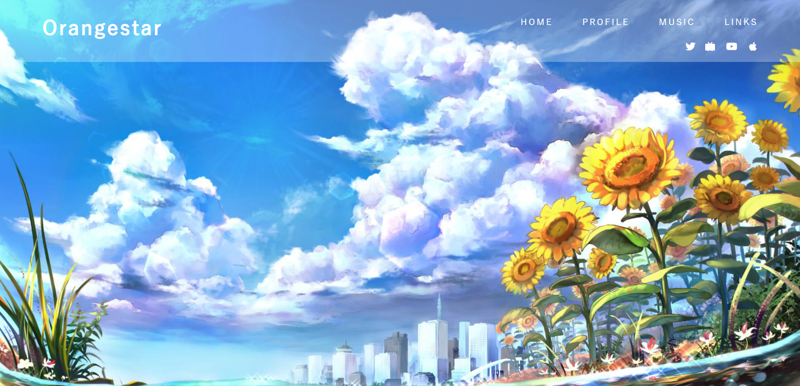
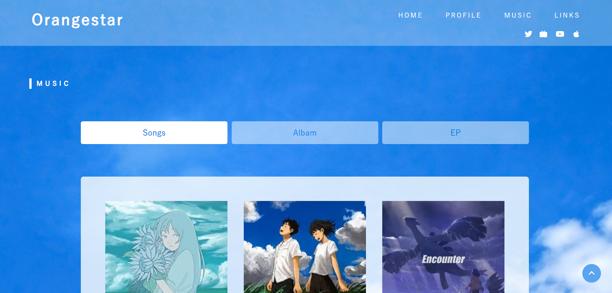

# アーティストサイト

HTML・CSSの授業課題として制作した、好きなアーティストを題材にしたWebサイトです。

### スクリーンショット

### 使用技術
- HTML
- CSS

### 制作時期
１年次

### 担当
個人制作課題のため、デザイン・コーディングをすべて担当しました。

### 工夫した点
UIコピペサイト「CSS Stock」を参考に、タブ切り替えを実装しました。
また、アーティストの雰囲気に合うように背景や配色、余白などにこだわりました。

### 今後ブラッシュアップしたい点
- レイアウトが崩れている箇所があるため、CSSを見直したい。
- 楽曲を１曲ずつHTMLで書いているため、管理しやすい構成に改善したい。
- 検索機能を実装し、楽曲に素早くアクセスできるようにしたい。

### GitHub Pages
https://plus-wisteria.github.io/orangestar.github.io/
